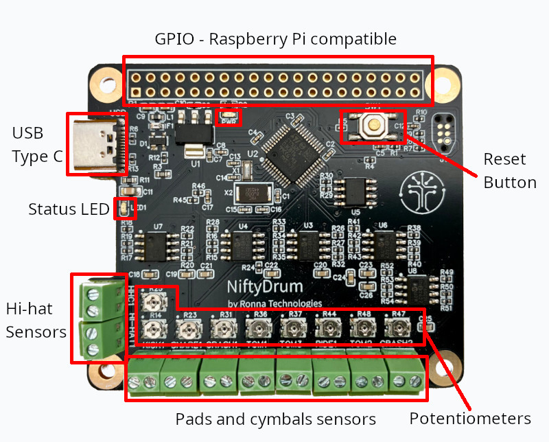

# The Board

## Description

The NiftyDrum board is shown by the following image:
{ width="480" .img-shadow .center}

This board has different interfaces:

- Terminal blocks to connect sensors
- USB type C to connect to a laptop or PC
- 9 potentiometers
- Two LEDs
- A reset button
- A Raspberry Pi-compatible GPIO
- 4 mounting holes

## How to connect the sensors

The board features 9 piezo inputs, allowing you to connect up to 9 single-zone pads.
On the left side of the board, there are two dedicated terminal blocks for the hi-hat sensors:

- The top terminal block connects to an FSR sensor, serving as the hi-hat controller input.
- The terminal block below is designed for a piezo sensor, used as the hi-hat cymbal trigger.

The remaining eight terminal blocks, located at the bottom of the board, are used to connect regular pads and cymbals.

For all terminal blocks, the ground pin is located on the left-hand side.

Additionally, nine onboard potentiometers allow you to fine-tune input sensitivities at the hardware level, offering maximum flexibility. But, if unsure, leave them set to their midpoint for balanced performance.

## MIDI outputs

The board provides two methods for outputting MIDI notes and Control Changes:

- USB-C port: Outputs USB MIDI messages.
- GPIO UART pins: Compatible with Raspberry Pi GPIO.

## USB-C port

It is recommended to use NiftyDrum as a USB device to get MIDI messages.
Doing so allows to use a DAW to get high quality sounds from a laptop.
This setup also lets you control the board using the [official app](2.app.md).
Here is a shortlist of what can be done with the app:

- Customize trigger MIDI notes
- Design velocity curves for each trigger
- Adjust advanced parameters per trigger:gain, threshold, scan time, mask time, and decay for each trigger

## Raspberry-Pi hat form factor

The board is designed with a Raspberry Pi 4 HAT form factor, ensuring seamless integration.
