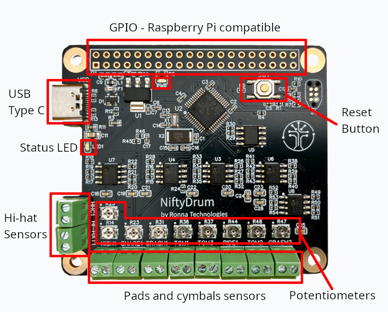

# The Boards

## NiftyDrum

The NiftyDrum board is shown in the following image.

{ width="480" .img-shadow .center}

This board features the following interfaces:

- Terminal blocks for sensor inputs
- USB Type-C port for laptop or PC connectivity
- 9 potentiometers for sensitivity adjustment
- 2 LEDs
- Reset button
- Raspberry Pi-compatible GPIO header
- 4 mounting holes

### Connecting Sensors

The board provides 9 piezo inputs, supporting up to 9 single-zone pads, as well as 1 FSR input.

#### Hi-Hat Sensors

On the left side of the board, two dedicated terminal blocks are reserved for hi-hat sensors:

- **Top terminal block**: Connects to an FSR (Force Sensing Resistor) sensor for hi-hat controller input
- **Bottom terminal block**: Connects to a piezo sensor for hi-hat cymbal trigger

#### Standard Pads and Cymbals

The remaining eight terminal blocks, located at the bottom of the board, are for connecting regular pads and cymbals. While the board labels indicate the default firmware assignments, these inputs are fully customizable.

#### Important Notes

- For all terminal blocks, the ground pin is positioned on the **left-hand side**
- Nine onboard potentiometers enable hardware-level sensitivity adjustments for maximum flexibility
- If unsure about sensitivity settings, leave potentiometers at their midpoint for balanced performance

### MIDI Outputs

The board offers two methods for transmitting MIDI notes and Control Changes:

- **USB-C port**: Outputs USB MIDI messages
- **GPIO UART pins**: Raspberry Pi GPIO-compatible interface

### USB-C Port

Using NiftyDrum as a USB device is the recommended method for receiving MIDI messages. This configuration enables:

- Integration with DAW software for high-quality sound output from your laptop
- Control and configuration via the [official app](2.app.md)

### Raspberry-Pi hat form factor

The board is designed with a Raspberry Pi 4 HAT form factor, ensuring seamless integration.

### App Features

The official app provides comprehensive control over your NiftyDrum board:

- Customize MIDI note assignments for each trigger
- Design custom velocity curves per trigger
- Adjust advanced parameters including gain, threshold, scan time, mask time, and decay
- Update board firmware to the latest version

## NiftyDrum+

## Latency

Latency is a big topic, and the goal here is to use the least resources possible while having a competitive overall latency.
Before we did into that subject, it's important to note that this parameter depends a lot on the microSD that is being used.
For me, a standard SD card performed pretty well, but it really depends.

The sound board has roughly the same latency of 4.5ms, which means that, including a scan time of about 2 or 2.5ms for a trigger input, the total latency is about: 2.5 + 4.5 + 1 = 8ms. I added 1ms to account for UART transfer between the trigger board and the sound board, as well as audio DAC latency.

In practice, I measured the latency using an oscilloscope. I wired a channel to the piezo sensor, and another one to the audio jack.
I hit the pad several times and recorded the time difference between the peak voltage of the piezo and the rise of the output sound.
Most of the time the latency was 8ms, as expected, but it reached 8.5 ms a few times, and was sometimes as low as 7ms.
I would say that, with a very safe margin, the latency is **less than 9ms**, but I advertise the latency as being less than 10ms, just to be on the safe side, especially because it depends on the scan time.

Not that this experiment is valid only for one sound at a time.
When several samples are triggered at *the same time*, which is never really true in practice, the samples are going to be played one after another, which will add a few hundred µs for each sample, except the first one.
