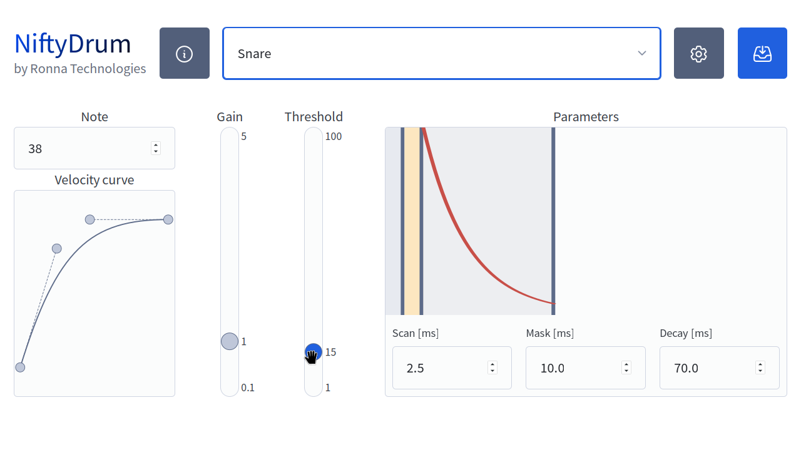
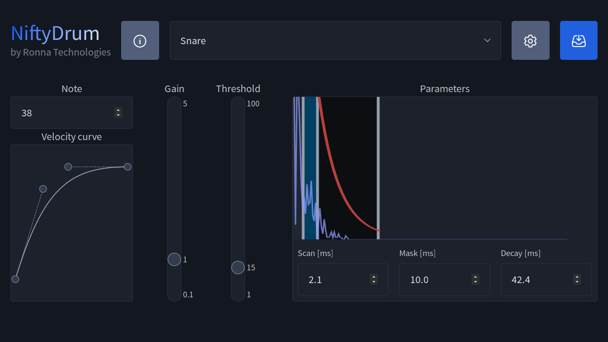
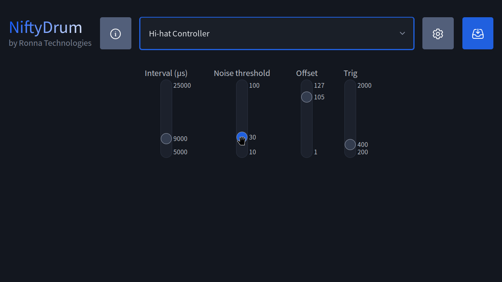

# The App

## Configure NiftyDrum

NiftyDrum is fully configurable, allowing you to adjust parameters like scan time, mask time, decay, threshold, etc.
To simplify customization, a dedicated desktop application is available, compatible with Windows, Linux, and macOS.

Below are all the different commands the app can send to the board.

### General Board Commands

| Command                  | Description                                      |
|--------------------------|--------------------------------------------------|
| Reset                    | Restart the board in bootloader mode             |
| Serial number            | Retrieve the board’s unique serial number        |
| Version                  | Retrieve the current firmware version            |
| Save current parameters  | Persist current settings to the board            |
| Load parameters          | Load previously saved board parameters           |
| Factory reset            | Reset all parameters to factory defaults         |

### Trigger Parameters (Per Trigger, Including Hi-Hat Cymbal)

| Parameter              | Description                                     |
|------------------------|-------------------------------------------------|
| Set/get velocity curve | Adjust or retrieve the velocity response curve  |
| Set/get threshold      | Configure the trigger activation threshold      |
| Scan time              | Set/get the trigger scan time                   |
| Mask time              | Set or adjust the trigger mask time             |
| Decay time             | Adjust the decay time of the trigger            |
| Gain                   | Adjust the gain level of the trigger            |
| MIDI Note              | Assign the MIDI note for the trigger            |

### Hi-Hat Pedal Parameters

| Parameter            | Description                                      |
|----------------------|--------------------------------------------------|
| Update interval      | Set the hi-hat pedal update frequency            |
| Noise threshold      | Ignore pedal changes below this value            |
| Pedal offset         | Determine if the hi-hat is fully closed          |
| Velocity threshold   | Set the velocity threshold for foot chick        |

### How the app works

The app simplifies customization by organizing everything logically: instruments are selected via a drop-down, while MIDI notes and velocity curves are managed separately from trigger settings for a cleaner, more efficient setup.

## How to install the app

he app is available for Windows, macOS, and Linux and can be downloaded directly from the official [NiftyDrum.com](https://niftydrum.com/#software){:target="_blank"} website. Follow the OS-specific instructions provided on the site.

### Windows

On Windows, the app is distributed as a `.zip` file, so no installation is required, simply extract and run it.
Note that, if that's not already done, you will have to install the [Microsoft Visual C++ Redistributable package](https://aka.ms/vs/17/release/vc_redist.x64.exe){:target="_blank"}.

### Linux

For Linux, the app is packaged as a `.deb` file. You can install it using your preferred package manager or by running the following command in a terminal:

=== "Ubuntu 22.04"

    ```bash
    sudo apt install --reinstall ./NiftyDrum-1.0.0-Ubuntu-22.04.deb
    ```

=== "Ubuntu 24.04"

    ```bash
    sudo apt install --reinstall ./NiftyDrum-1.0.0-Ubuntu-24.04.deb
    ```

=== "debian"

    ```bash
    sudo apt install --reinstall ./NiftyDrum-1.0.0-Linux.deb
    ```

### macOS

The macOS version of the app is provided as a `.zip` file. Just extract it and run the application.
If you're using an Apple Silicon Mac, you may be prompted to install Rosetta the first time you launch the app.

## Piezo trigger configuration

Customize each piezo trigger by selecting your desired instrument from the dropdown menu.
The screenshot below illustrates the process for configuring the snare drum.

{ .light-mode-only .img-shadow-lg  }
{ .dark-mode-only .img-shadow-lg  }

On the left side, you can assign the MIDI note for the pad—such as note 38 for the snare. Below the note input, you’ll find the velocity curve editor, which uses Bézier controls for precise adjustments. You can drag and drop the endpoints and the two middle control points to shape the curve according to your needs.
The horizontal axis reflects the raw MIDI velocity detected by the sensor, while the vertical axis shows the velocity value transmitted over USB. This setup lets you fine-tune the responsiveness and dynamics of your triggers.

Moving from left to right, you can adjust the trigger gain within a range of 0.1 to 5. This allows you to boost the input sensitivity of the trigger, enhancing the volume of ghost notes when the velocity curve alone isn’t sufficient. It’s important to note that the gain is applied after a strike has been detected, so it doesn’t impact the threshold setting.

Next is the threshold setting, which sets the minimum signal level the piezo must exceed for a hit to register. This ensures only intentional strikes are detected, effectively filtering out unwanted noise and preventing false triggers.

## Hi-hat pedal configuration

The last item of the dropdown menu is the hi-hat pedal configuration. It is a bit different from the other inputs.


{ .light-mode-only .img-shadow-lg }
{ .dark-mode-only .img-shadow-lg }
