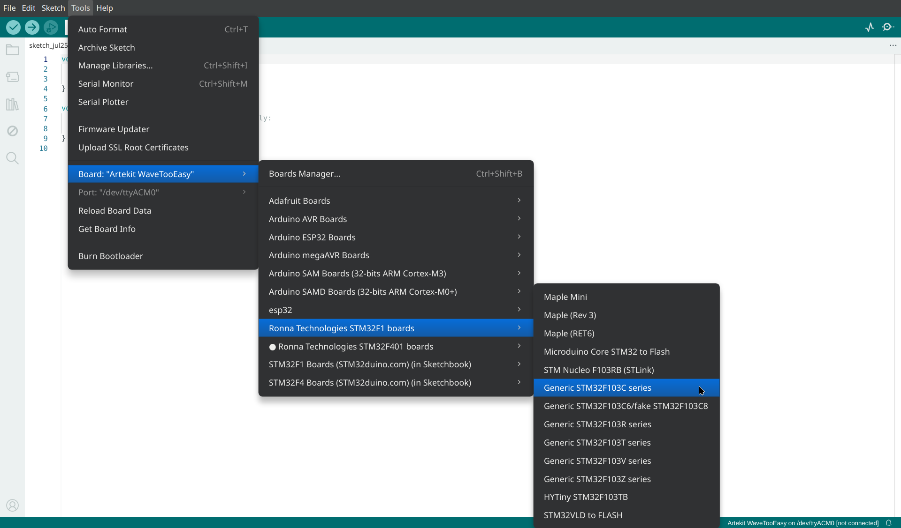
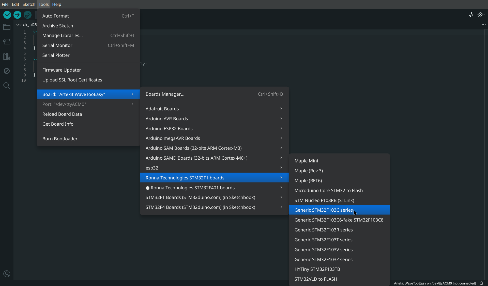
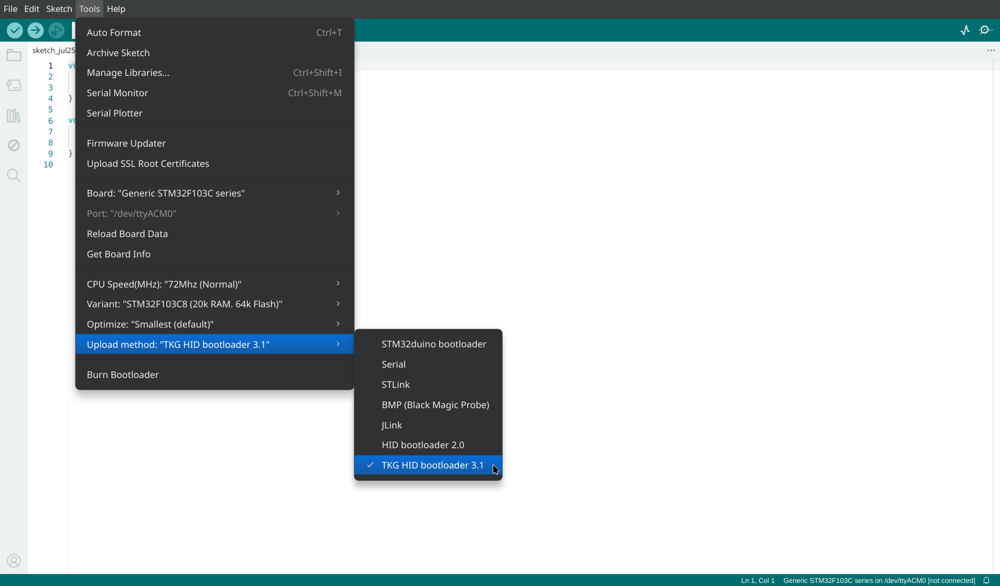
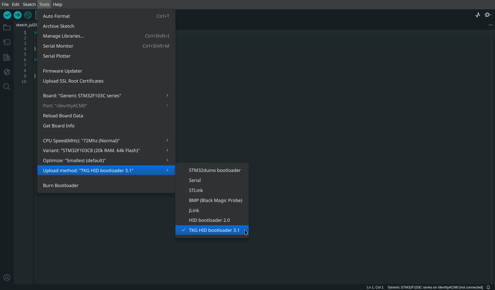

# Sensor SDK

## That's a Blue Pill

NiftyDrum is powered by the **STM32F103C8T6** microcontroller, the same chip found in the "**Blue Pill**" development board.

If you're unfamiliar with the Blue Pill, it’s a widely recognized and versatile board based on the STM32F103C microcontroller family. With **72MHz** clock speed, **64KB of flash** memory, and **20KB of RAM**, it offers plenty of flexibility for customization and experimentation.

## Arduino IDE

Since NiftyDrum uses the same microcontroller as the Blue Pill, you can program the board using the Arduino IDE.

### Arduino STM32 SDK

Once you have a working ARM None-EABI toolchain, you will need to install the Arduino STM32 RonnaTech SDK.

!!! note
    Although it's called Arduino STM32 RonnaTech SDK, this is actually a fork of [Roger Clark's Arduino STM32 repository](https://github.com/rogerclarkmelbourne/Arduino_STM32){:target=_blank} with some minor modifications.

Here are the steps to follow to install the SDK and use it in the Arduino IDE: 

1. Open **File > Preferences** in the Arduino IDE.
2. Add the following URL to the **Additional boards manager URLs** field:

   ```text
   https://ronnatech.com/wp-content/uploads/package_ronnatech_index.json
   ```

3. Open the Boards Manager and search for RonnaTech.
4. Select `Ronna Technologies STM32F1` boards and install the latest version.

Go to the board manager and search for `stm32`. Once that is done, you can select the board from the menu:

{ .light-mode-only .img-shadow-lg }
{ .dark-mode-only .img-shadow-lg }

{ .light-mode-only .img-shadow-lg }
{ .dark-mode-only .img-shadow-lg }

Be sure to select the correct CPU frequency, variant, and upload method, as shown on the image above.
The most reliable way to build the firmware is to go to the `Sketch` menu and click on `Export Compiled Binary`, or use the shortcut ++alt+ctrl+s++. Then, to find the firmware file, got to `Sketch` again, and `Show Sketch Folder`, or use the shortcut ++alt+ctrl+k++.

To upload the firmware to the board, first enter bootloader mode on the board by double pressing the on-board button.
The LED should blink fast.
Download [`tkg-flash`](https://github.com/TheKikGen/stm32-tkg-hid-bootloader/tree/master/cli/binaries_dist){:target="_blank"}. pload the firmware via terminal:

=== "Unix"

    ```bash
    ./tkg-flash sketch.ino.bin
    ```

=== "Windows"

    ```bash
    ./tkg-flash.exe sketch.ino.bin
    ```

Once the upload is complete, the board will **restart automatically**, and the app will **reconnect** to it.

### Arduino CLI

In this section, I will describe how to setup a configuration file to compile and upload a sketch using Arduino CLI.
The binary is available from most platforms, but if you want to install it yourself you can [download it from GitHub](https://github.com/arduino/arduino-cli/releases).

Usually, I create a JSON file that holds the configuration I want.
It looks like this:

```json title="arduino.json"
{
    "configuration": "device_variant=STM32F103C8,upload_method=TKG-HIDUploadMethod,cpu_speed=speed_72mhz,opt=osstd",
    "board": "Arduino_STM32:STM32F1:genericSTM32F103C",
    "sketch": "NiftyDrum.ino",
    "port": "/dev/ttyACM0",
    "output": "./output"
}
```

If you use [VSCode](https://code.visualstudio.com/), you can put the file into a `.vscode` folder, and install the [Arduino Community Edition](https://marketplace.visualstudio.com/items?itemName=vscode-arduino.vscode-arduino-community) extension, and it will work out of the box.

```bash title="build.sh"
#!/bin/bash

FQBN=$(jq -r '.board' arduino.json)
PORT=$(jq -r '.port' arduino.json)
CONFIG=$(jq -r '.configuration' arduino.json)
SKETCH=$(jq -r '.sketch' arduino.json)
OUTPUT=$(jq -r '.output' arduino.json)

rm -rf ./build/*

# Compile the sketch
./arduino-cli compile -v -v --fqbn "${FQBN}:${CONFIG}" --port $PORT $SKETCH --build-path build --output-dir $OUTPUT

# Upload the sketch
./tkg-flash $OUTPUT/$SKETCH.bin
```

### Blink Example

Writing code for the NiftyDrum board is as straightforward as programming any Arduino. Here's a simple blink example:

```cpp title="blink.ino"
// The setup function runs once when you press reset or power the board
void setup() {
  // Initialize digital pin LED_BUILTIN as an output
  pinMode(LED_BUILTIN, OUTPUT);
}

// The loop function runs repeatedly forever
void loop() {
  digitalWrite(LED_BUILTIN, HIGH);  // Turn the LED on
  delay(1000);                      // Wait for a second
  digitalWrite(LED_BUILTIN, LOW);   // Turn the LED off 
  delay(1000);                      // Wait for a second
}
```

## Sending MIDI Notes

```cpp title="midi.ino"
#undef min
#undef max
#undef true
#undef false

#include <USBComposite.h>

USBCompositeSerial serial;
USBMIDI midi;

void setup()
{
    USBComposite.clear();

    USBComposite.setVendorId(0x0483);
    USBComposite.setProductId(0x5740);
    USBComposite.setProductString("NiftyDrum");
    USBComposite.setManufacturerString("Ronna Technologies");

    serial.registerComponent();
    serial.setTimeout(0);

    midi.registerComponent();

    USBComposite.begin();

    const auto br = 115'200;
    Serial3.begin(br, SERIAL_8N1);

    while (!USBComposite.isReady())
      ;

    pinMode(PC13, OUTPUT);
    digitalWrite(PC13, LOW);
}

void loop()
{
    for(;;)
    {
      midi.sendNoteOn(9, 38, 64);
      delayMicroseconds(100'000); 
    }
}
```
