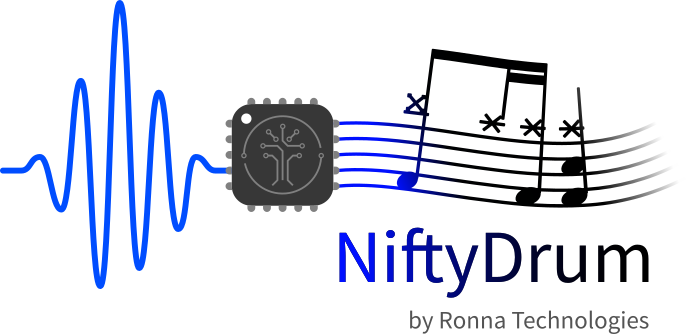
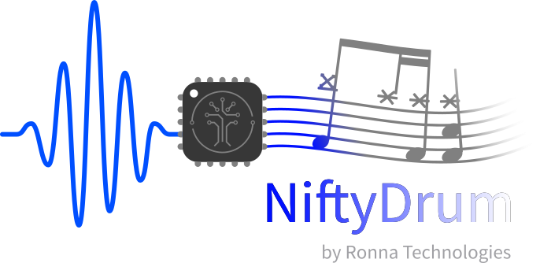

# About NiftyDrum

{ width="400" .light-mode-only .center}
{ width="400" .dark-mode-only .center}

## Description

NiftyDrum is a trigger-to-MIDI conversion module that transforms piezo and FSR sensor inputs into MIDI messages. Connect up to 9 piezo sensors and 1 FSR (Force Sensing Resistor) to the dedicated terminal blocks, then receive MIDI data via USB-C connection.

## How It Works

NiftyDrum delivers high-level MIDI performance in 4 easy steps:

- **Connect sensors**: Attach up to 9 piezo sensors and 1 FSR to the terminal blocks
- **Plug in**: Connect to your DAW, Raspberry Pi, or drum module via USB
- **Configure**: Use the web-based GUI to adjust trigger parameters, MIDI mapping, and velocity curves
- **Play**: Notes are transmitted instantly with imperceptible latency

## Specifications

### Hardware

- **Piezo inputs**: 9 channels
- **FSR input**: 1 channel (hi-hat controller)
- **Connector type**: Terminal blocks
- **USB interface**: Type-C
- **Dimensions**: 65 × 56.5 mm

### Performance

- **Latency**: <2.5 ms
- **Sample rate**: >10 kHz
- **Velocity resolution**: 127 levels (full MIDI range)

### Software

- **Platform support**: Windows, macOS, Linux
- **User interface**: Web-based application
- **Firmware updates**: Via USB
- **MIDI output**: Note messages and Control Changes (CC)
