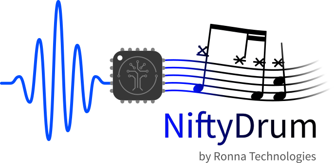
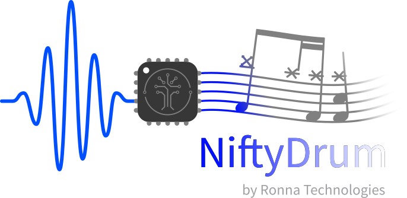

# NiftyDrum(+)

{ width="400" .light-mode-only .center}
{ width="400" .dark-mode-only .center}

## Description

- **NiftyDrum** is a trigger-to-MIDI conversion module that transforms piezo and FSR sensor inputs into MIDI messages. Connect up to 9 piezo sensors and 1 FSR (Force Sensing Resistor) to the dedicated terminal blocks, then receive MIDI data via USB-C connection.
- **NiftyDrum+** is a single, unified board combining our NiftyDrum's sensor-to-MIDI interface with a powerful sound engine. Sound samples are stored on a microSD card, and are streamed to a 3.5mm jack output.

## How It Works

NiftyDrum delivers high-level MIDI performance in 4 easy steps:

- **Connect sensors**: Attach up to 9 piezo sensors and 1 FSR to the terminal blocks
- **Plug in**: Connect to your DAW, Raspberry Pi, or drum module via USB
- **Configure**: Use the web-based GUI to adjust trigger parameters, MIDI mapping, and velocity curves
- **Play**: Notes are transmitted instantly with imperceptible latency

A fifth step can be added: **Use NiftyDrum+ sound engine and get a fully-featured drum module.**

## What Makes the Project Special

NiftyDrum and NiftyDrym+ both ship with their own firmware.
This make NiftyDrum+ a fully-featured drum module by default.
In addition to that, we provide two **Arduino**-compatible SDKs:

- [A Sensor SDK](./4.sensor_sdk.md)
- [A Sound SDK](./5.sound_sdk.md)

The SDKs give you tools to develop you own drum module.

## Specifications

### Hardware

- **Piezo inputs**: 9 channels
- **FSR input**: 1 channel (hi-hat controller)
- **Connector type**: Terminal blocks
- **USB interface**: Type-C
- **Dimensions**: 65 × 56.5 mm
- **Audio**: TRS 3.5mm (⅛")

### Performance

- **Latency**: <2.5 ms
- **Sensor Sampling rate**: >10 kHz
- **Velocity resolution**: 127 levels (full MIDI range)
- **Trigger to Sound Latency**: <10ms
- **Audio Sampling Rate**: ≥44.1kHz

### Software

- **Platform support**: Windows, macOS, Linux
- **User interface**: Web-based application
- **Firmware updates**: Via USB
- **MIDI output**: Note messages and Control Changes (CC)
- **Development**: Arduino SDKs
